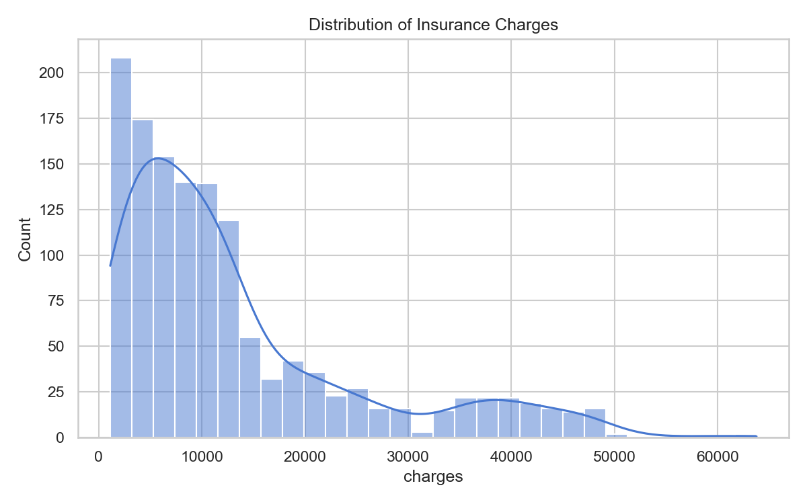
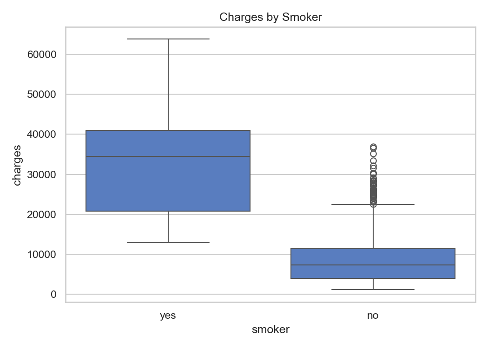
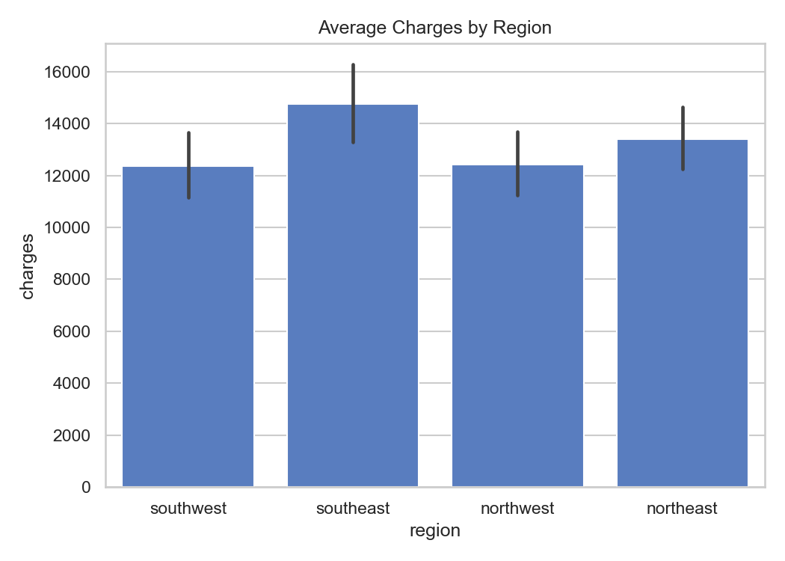
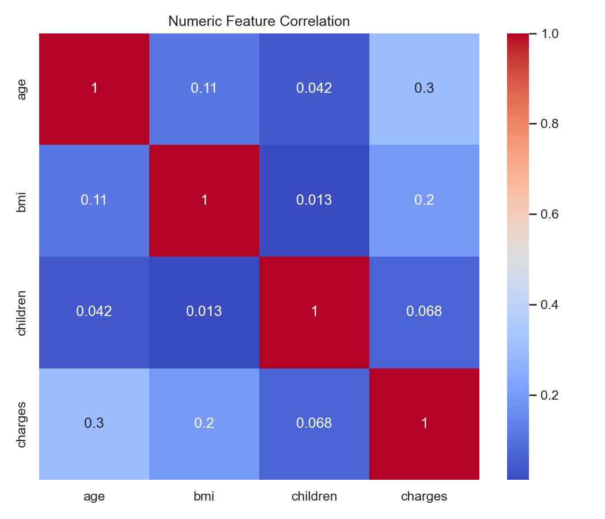
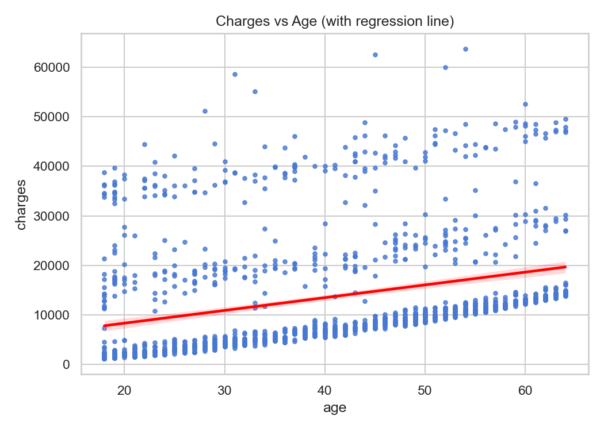
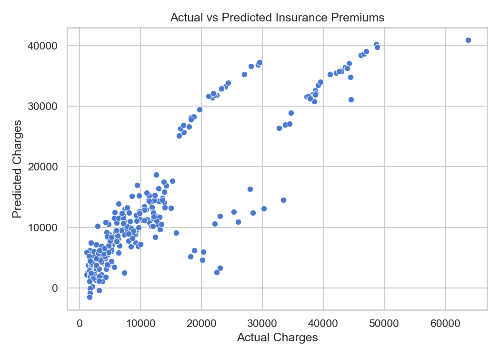

# Data-Driven Risk Analysis and Claim Prediction in Insurance

> A complete end-to-end Data Science project that applies Exploratory Data Analysis, Feature Engineering, SQL integration, and Machine Learning to identify risk patterns and predict insurance premium charges from customer and policy data.

**Author:** Kaustav Purkayastha — MCA Final Year, Lovely Professional University (LPU)

---

## Table of Contents

- [Project Overview](#project-overview)
- [Dataset](#dataset)
- [Tech Stack](#tech-stack)
- [Project Structure](#project-structure)
- [Methodology](#methodology)
  - [1. Data Ingestion & Storage](#1-data-ingestion--storage)
  - [2. Exploratory Data Analysis](#2-exploratory-data-analysis)
  - [3. Feature Engineering](#3-feature-engineering)
  - [4. Model Training & Evaluation](#4-model-training--evaluation)
  - [5. Business Insights](#5-business-insights)
- [Model Performance](#model-performance)
- [Visual Outputs](#visual-outputs)
- [How to Use](#how-to-use)
- [License](#license)

---

## Project Overview

Insurance companies face the challenge of accurately pricing policies based on the risk profile of individual customers. Underpricing leads to losses; overpricing drives customers away. This project addresses that problem by building a data pipeline that:

1. **Ingests** publicly available insurance policy data
2. **Stores** it in a relational SQLite database
3. **Explores** key patterns through statistical analysis and visualizations
4. **Engineers** meaningful features from raw demographic data
5. **Trains** a Linear Regression model to predict annual premium charges
6. **Persists** the trained model for future inference

The result is a reproducible, notebook-driven analysis that surfaces actionable insights for risk segmentation and premium pricing strategy.

---

## Dataset

| Property | Detail |
|---|---|
| **Source** | [Machine Learning with R Datasets — stedy/GitHub](https://raw.githubusercontent.com/stedy/Machine-Learning-with-R-datasets/master/insurance.csv) |
| **Records** | 1,338 policyholders |
| **Features** | 7 |
| **Target Variable** | `charges` — Annual insurance premium in USD |
| **Missing Values** | None |

### Feature Description

| Feature | Type | Description |
|---|---|---|
| `age` | Integer | Age of the primary policyholder |
| `sex` | Categorical | Gender of the policyholder (`male` / `female`) |
| `bmi` | Float | Body Mass Index — measure of body fat based on height and weight |
| `children` | Integer | Number of dependents covered under the policy |
| `smoker` | Categorical | Whether the policyholder is a smoker (`yes` / `no`) |
| `region` | Categorical | Residential region in the US (`northeast`, `northwest`, `southeast`, `southwest`) |
| `charges` | Float | Individual medical costs billed by the insurance company (target) |

---

## Tech Stack

| Layer | Technology |
|---|---|
| Language | Python 3.x |
| Data Manipulation | pandas, NumPy |
| Visualization | Matplotlib, Seaborn |
| Database | SQLite3 (via Python's built-in `sqlite3` module) |
| Machine Learning | scikit-learn (LinearRegression, Pipeline, ColumnTransformer, OneHotEncoder) |
| Model Persistence | joblib |
| Notebook | Jupyter Notebook |

---

## Project Structure

```
insurance_risk_predictor/
│
├── data/
│   └── insurance.csv               # Raw dataset (auto-downloaded on first run)
│
├── outputs/
│   ├── insurance.db                # SQLite database storing the cleaned dataset
│   ├── figures/
│   │   ├── charges_distribution.png
│   │   ├── charges_by_smoker.png
│   │   ├── avg_charges_by_region.png
│   │   ├── correlation_heatmap.png
│   │   ├── charges_vs_age_regplot.png
│   │   └── actual_vs_predicted.png
│   └── models/
│       └── insurance_model.pkl     # Serialised trained model
│
├── 01_insurance_claim_analysis.ipynb   # Main analysis notebook
├── .gitignore
├── LICENSE
└── README.md
```

---

## Methodology

### 1. Data Ingestion & Storage

The notebook auto-downloads the dataset from its public URL on first run and saves it to `data/insurance.csv`. If the file already exists locally, it skips the download — making re-runs fast.

After loading into a pandas DataFrame, all categorical fields (`sex`, `smoker`, `region`) are normalised to lowercase to prevent case-sensitivity issues. The cleaned data is then written to a **SQLite database** (`outputs/insurance.db`) under the `insurance` table, enabling SQL-style querying on top of the dataset.

---

### 2. Exploratory Data Analysis

Six visualisations are generated to uncover patterns in the data:

| Plot | Purpose |
|---|---|
| Charge Distribution | Understand the skewness and spread of premium charges |
| Charges by Smoker | Compare premium ranges between smokers and non-smokers |
| Avg Charges by Region | Identify geographic pricing differences |
| Correlation Heatmap | Reveal linear relationships between numeric features |
| Charges vs Age (Regression) | Visualise the age-premium growth trend |
| Actual vs Predicted | Evaluate model fit quality |

All figures are saved at 150 DPI to `outputs/figures/`.

---

### 3. Feature Engineering

Two derived features are added to enrich the dataset before modelling:

| New Feature | Derived From | Description |
|---|---|---|
| `age_band` | `age` | Groups policyholders into 5 age brackets: `18-25`, `26-35`, `36-45`, `46-55`, `56-65` |
| `smoker_flag` | `smoker` | Binary integer encoding of smoking status (`1` = smoker, `0` = non-smoker) |

---

### 4. Model Training & Evaluation

A **scikit-learn Pipeline** is used to chain preprocessing and modelling in a single, clean object — preventing data leakage between train and test splits.

**Pipeline structure:**

```
ColumnTransformer
├── Passthrough  →  numeric features (age, bmi, children, smoker_flag, ...)
└── OneHotEncoder  →  categorical features (sex, smoker, region)
        ↓
LinearRegression
```

- **Train / Test Split:** 80% / 20% (`random_state=42`)
- **Algorithm:** Ordinary Least Squares Linear Regression
- **Trained model saved to:** `outputs/models/insurance_model.pkl`

---

### 5. Business Insights

| Finding | Implication |
|---|---|
| **Smoking** is the single strongest predictor of charges | Smokers are charged significantly more — risk segmentation on smoking status has the highest ROI for underwriting accuracy |
| **Age** shows a strong positive correlation with charges | Premiums should scale with age; customers aged 45+ represent the steepest cost growth segment |
| **BMI** contributes to higher charges | High-BMI cohorts can be flagged for targeted health benefit products or preventive care programs |
| **Region** has minimal effect on charges | Premium pricing does not need strong regional differentiation — standardised national pricing is defensible |
| **Top 10% predicted-cost cohort** | Customers predicted above the 90th percentile should be routed for manual underwriting review and tailored policy structuring |

---

## Model Performance

| Metric | Value |
|---|---|
| **RMSE** | $5,796.28 |
| **R² Score** | 0.784 |

The model explains **78.4%** of the variance in insurance charges using only 6 input features, demonstrating that a well-structured linear model with proper feature encoding is highly effective for this type of actuarial estimation.

---

## Visual Outputs

### Distribution of Insurance Charges
> Shows a right-skewed distribution — most policyholders fall in the low-to-mid charge range, with a long tail of high-cost outliers (typically smokers or older, high-BMI individuals).



---

### Charges by Smoker Status
> Smokers show dramatically higher and more variable charges. The interquartile range for smokers starts where the non-smoker distribution peaks — a clear signal for risk-based pricing.



---

### Average Charges by Region
> Regional differences in average premiums are modest. The southeast shows a marginally higher average, potentially linked to higher average BMI in that demographic.



---

### Correlation Heatmap
> Among numeric features, `age` and `bmi` have the strongest positive correlations with `charges`. `children` has a weak relationship, suggesting family size is not a major pricing driver.



---

### Charges vs Age (Regression Line)
> A clear upward trend is visible. The scatter also reveals two distinct charge clusters across age groups — corresponding to smokers (upper band) and non-smokers (lower band).



---

### Actual vs Predicted Premiums
> Points clustering along the diagonal indicate good model fit. Deviations at the high end reflect the non-linear interaction between smoking and age that a linear model partially captures but cannot fully model without polynomial or interaction terms.



---

## How to Use

### Prerequisites

Make sure you have Python 3.x installed with the following packages:

```bash
pip install pandas numpy matplotlib seaborn scikit-learn joblib requests
```

Or install everything at once:

```bash
pip install -r requirements.txt
```

### Running the Notebook

1. **Clone the repository**

   ```bash
   git clone https://github.com/Kaustav-Purkayastha/insurance_risk_predictor.git
   cd insurance_risk_predictor
   ```

2. **Launch Jupyter Notebook**

   ```bash
   jupyter notebook
   ```

3. **Open the main notebook**

   In the Jupyter interface, open `01_insurance_claim_analysis.ipynb`.

4. **Run all cells top to bottom**

   Use `Kernel → Restart & Run All` to execute the entire pipeline in one go.  
   The notebook will:
   - Auto-download the dataset if not already present
   - Clean and store data in SQLite
   - Generate and save all 6 visualisation plots to `outputs/figures/`
   - Train the regression model and save it to `outputs/models/insurance_model.pkl`

5. **Load the saved model for inference** (optional)

   ```python
   import joblib
   import pandas as pd

   model = joblib.load("outputs/models/insurance_model.pkl")

   # Example: predict charges for a new customer
   new_customer = pd.DataFrame([{
       "age": 35, "sex": "male", "bmi": 28.5,
       "children": 1, "smoker": "no", "region": "northeast",
       "age_band": "26-35", "smoker_flag": 0
   }])

   predicted_charge = model.predict(new_customer)
   print(f"Predicted annual charge: ${predicted_charge[0]:,.2f}")
   ```

---

## License

This project is licensed under the [MIT License](LICENSE).
